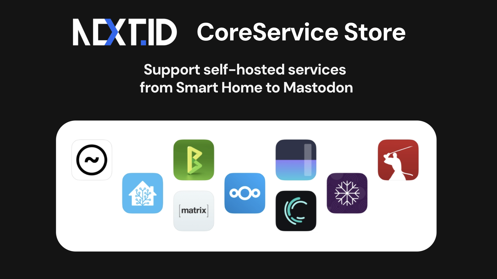

`Core Service` embodies our ultimate vision for individual data sovereignty: that is, users should have complete control over their own data.
To achieve this goal, two conditions must be met:
1. Users should have full control over their own data servers. Ideally, the data should be stored on the user's personal computer. If the data is stored on a cloud service, it should be encrypted before being uploaded.
2. The server should have sufficient performance capabilities to handle the external API request load.

Therefore, to explore this possibility, our approach is to give you a user-friendly way to let you self-host all the services by yourself, we call it `Core Service`. Thanks to the development of Docker and other containerization tools, makes it possible for us to host the service and avoid depending on any third party. You can host the service on your personal devices or on relatively reliable cloud service providers like Digital Ocean.
We hope that personal devices or computers can have performance comparable to servers so that cloud service providers can become public goods like blockchain. On such platforms, each user's data would belong entirely to the user, not to the company behind the centralized service.

In `Core Service`, we will package all the services to docker images, and provide the docker-compose.yaml file to run the CoreService. There will be a dashboard that functions as CoreService Store to help deploy the other services you may need. 

# How it works
We will package all the services to docker images, and provide the docker-compose.yaml file to run the CoreService. 

An example of [docker-compose.yaml](https://github.com/NextDotID/core_service_sharp/blob/develop/build/docker-compose.yml)

After running the CoreService, there will be a dashboard to help deploy the other services you might need to self-host, e.g., ProofService and RelationService via the docker-compose file and the necessary configurations.

## Code Reference

[Core Service](https://github.com/NextDotID/core_service_sharp)

