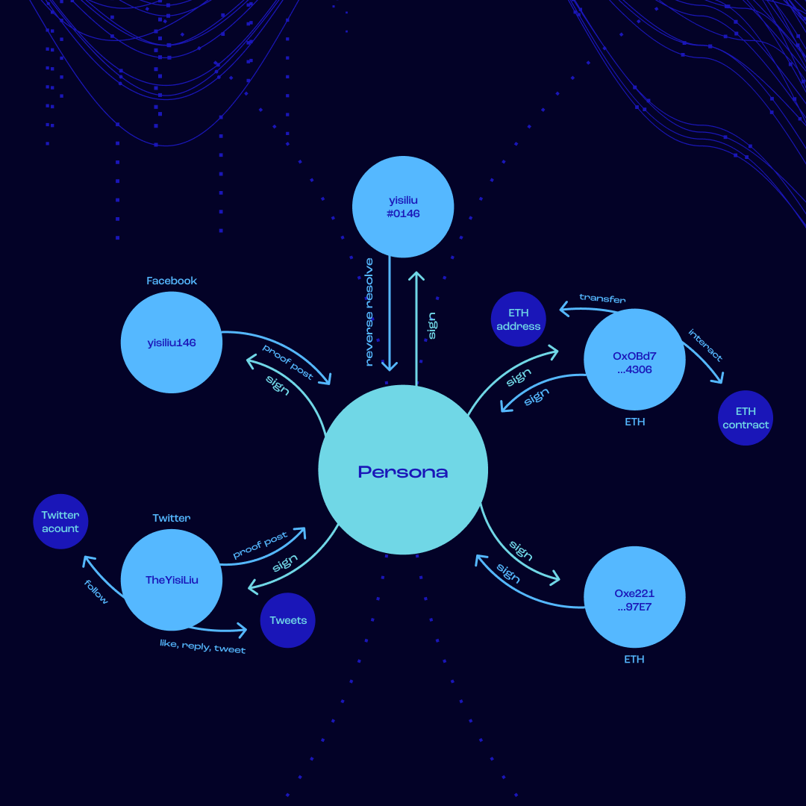

`ProofService` offers a DID service that establishes a bridge between the Avatar and identity providers from both web2 platforms (like Twitter, Discord, etc.) and web3 identities (such as Ethereum and Bitcoin wallet addresses). This aims to provide users with a holistic, publicly verifiable identity graph. Simultaneously, users maintain the autonomy to manage their digital identities. In the end, the avatar and these identities combine to form an identity graph as below:



## How to build the connection 

### Work Flow
Use Twitter platform as an example to explain how to use `ProofService` to build a bi-directional binding between a Twitter account and an avatar:

1. Construct a SignaturePayload with the necessary information, which is defined as:

```
Struct SignaturePayload {
    action: Action,  // create/delete, refer to bind/unbind
    created_at: number, // timestamp 
    platform: Platform;
    identity: string;
    prev :null | string, //the previous create/delete operation signature related to this avatar
    uuid: string //unique_id for the operation
}
```

2. Sign the payload with the private key of the avatar
3. Post the signed payload with that Twitter account
4. Callback ProofService and give back the location(the url) of the tweet that contains the signature. `ProofService` records the binding after passing the signature verification. In this scenario, it would get the signature from the link, check the validation, and also check the Twitter account that posts the tweet is matched with the identity in signature_payload.

Basically, the generic idea is to prove that the Avatar and another identity belong to the same owner. The first and second step proves the ownership of the avatar through the signature, and a public post on twitter to prove the ownership of that Twitter account.

### Data Structure

After the binding, ProofService will use a blockchain-like model called ProofChain to record of "Avatar <-> Identity" connection(we called Proof) and save it in both the ProofService side and upload it to Arweave. The definitions of the proof and proofchain are as the followings.

#### Proof

The definition of the proof contains all the necessary information between the connection of "Avatar <-> Identity", contains the operation type that is binding or dismiss, which platform and identity, timestamp, signature by the avatar...
The structure is definied as:

```
type Signature = string;

// All available chain modification actions
enum Action {
    Create = "create",
    Delete = "delete",
}

// All supported platforms, detail at: https://github.com/NextDotID/proof_server#which-platform-can-i-prove
enum Platform {
    Twitter = "twitter",
    Keybase = "keybase",
    ...
}

// Each proof in the proof chain
interface Proof {
    // If this is genesis link, leave it null; else, it equals
    // previous link's signature. Worked as a pointer.
    prev: Signature | null;
    
    avatar: String;
    action: Action;
    platform: Platform;
    identity: string;
    
    // if action === Action.create, it shouldn't be empty(except ethereum); else, left null
    proof_location: string | null;
    
    // UNIX timestamp (unit: second)
    created_at: number;
    
    // An UUID of this link, works as a global identifier.
    uuid: string;
    
    // See the definition above
    signature_payload: SignaturePayload;
    
    // Signature of this link made by avatar.
    signature: Signature;
}
```
#### Proofchain
Since the definition of Proof struct contains a field `prev`, all the Proof records under the same specific avatar will combine as a ProofChain.The definition is like the following:
```
const VERSION = "1";

interface ProofChain {
    version: VERSION;
    avatar: string
    //check the definition of `Proof` above.
    proofs: Proof[];
}
```
There is an API provided by `ProofSerive` to get the ProofChain of an avatar:
(link-to-proof-chain-api)

### Data Location
From day one, the connection data in Proof Service to public so that everyone can access it via API or Arweave.
[API docs](../../rest-api/kvservice-api.md)
[An example of data in Arweave](https://viewblock.io/arweave/tx/wvzDhXgcglrUWob9CUjTfJ6tj322eCWDKI2bVtU_cx4)

Noted that the APIs in the docs contain the API to help bind "Avatar <-> Identity", like `POST /v1/proof/payload` or `POST /v1/proof`, but also serval APIs to query the state of the [proofs](https://github.com/NextDotID/proof_server/blob/develop/docs/api.apib#L160) and [the proofchain under an avatar](https://github.com/NextDotID/proof_server/blob/develop/docs/api.apib#L285).
The Arweave example contains the single Proof record and based on the mechanism of Arweave, can keep getting the previous record until Genesis one.

## Supported Platform 
[Supported Platform](https://github.com/NextDotID/proof_server#supported)

## How to contribute
As an open-source project, we welcome all interested developers to contribute and build with us, especially integrating more platform identity. What you need to do is:
- Checkout our repository on [GitHub](https://github.com/NextDotID/proof_server)
- Open an issue and give the idea
- Coding and submitting the merge request
