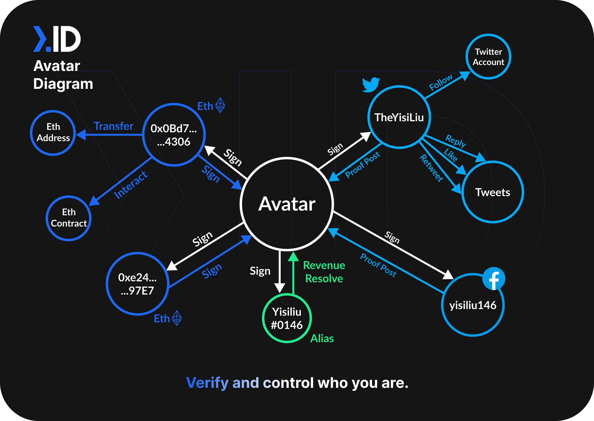

Next ID is an decentralized identity (DID) creation and management protocol built for developers. The Next ID protocol is used as the secure connecting fiber between different web2 and web3 **identifiers**, such as **wallets**, **twitter profiles**, **ENS names**, **Lens profiles,** and many more.

By connecting a person’s different identifiers together, they form an **identity graph** - a powerful, portable, sovereign digital identities. Next ID refers to these identities, digital representations of self, as **avatars.**

We provide services for creating DIDs, querying existing relationships, attaching data payloads to DIDs.

- Don’t know what DIDs are? —> [Video explainer link](https://www.youtube.com/watch?v=zaYYQLDnS6s&t=12s)

### What is an Identity Graph?

An identity graph is a the network of a user’s identifiers (addresses, social profiles, etc.). Using secure key pair (*Avatar*) signatures, entities are bonded to an address. 

### Identity + data

Next.ID’s KVService functions as a data backpack. Fundamentally, it is a way to attach a payload (data) to an Avatar/ID graph. For example, a social graph of follows/followers can be appended to a DID, enabling simple portability, making the data travel wherever the user goes.

### Data integrity

DIDs are created and modified using a cryptographically secured private-public key pairing (*Avatar*) system. This ensures every change and its history are only made by users with the right private keys.

Every changes and its history are publicly available and verifiable on Arweave, following Next ID’s commitment to decentralization and transparency.

## Current real world use cases

The list of protocols and dApps using Next.ID is growing weekly. Here are a few of the early adopters:

| Developers | Purpose | 
|---|---|
| Mask Network | Permissionless platform that bridges Web2 users to Web3 |
| KNN3 | Social graph data solution for Web3 relational data exploration. |
| RSS3 | Content syndication protocol that allows aggregation of Web2 and Web3 content. |
| SwapChat/Web3MQ | Cross-platform chat protocols that allow users to send messages and group chats on Opensea and Twitter to realize social NFT trading. |
| Web3.bio | Frontend profile page for Web3 identities |
| .bit | Web3 data container and naming service that enables users to link ENS and other identity services. |

## Approaches Next.ID‘s taking
### ProofService – Ensure data integrity with cryptography
ProofChain follows a blockchain-like model to retain data integrity, using cryptography and the private-public key pairing system. This ensures that only users with the right private keys will be able to add to the data in each “block”.

ProofService and every change in its history are fully visible on Arweave, true to the Next.ID community’s commitment to full transparency for its protocols.

### KVService – Organize and make sense of the data provided by users
As users and protocols read and write data using Next.ID, KVService sets up a framework to organize the information neatly. This enables smoother frontend usage of Next.ID, as well as allows developers a clearer understanding of how Next.ID can be utilized.

### RelationService – Enable comprehensive identity queries and social use cases
RelationService is an aggregation of existing IDs, ID queries, and IDs bound to and in parallel to Next.ID, opening up a range of possibilities for integration with external protocols and creating greater Web3 native social use cases

> Note: RelationService is currently WIP and will be released soon. We included it here for a more coherent picture of how Next.ID will function.

## What next?

- Try it out [for yourself](./quick-start.md)!
- Understand how it works in detail
