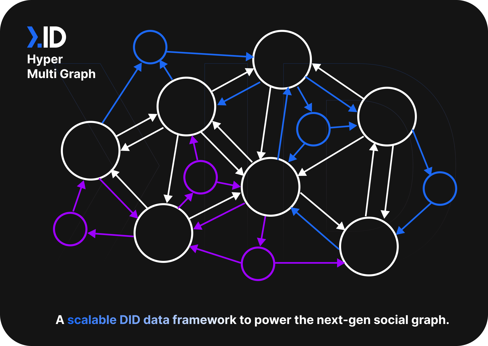

Next.ID, the world’s first protocol offering Decentralized-Identity-As-A-Service (DIaaS), is a decentralized identity aggregation protocol that integrates all Web2 and Web3 digital identities, offering a comprehensive and verifiable identity database for open-source developers and projects to innovate and build dApps on.

Next.ID creates an identity infrastructure that securely aggregates users’ identities into Avatars, making it the primary touch point for interfacing with any app or dApp, for example in social:

Next.ID’s Avatars exist independently from Web2 and Web3, using a blockchain-like model to retain data integrity. This allows Next.ID to connect to all Web2 and Web3 platforms, aggregating all identities in a fully-agnostic way, unifying them into one single decentralized identifier (DID).

Welcome to the future of Digital Identity.

## User Cases

The list of protocols and dApps using Next.ID is growing weekly. Here are just some of them:

| Developers | Purpose | 
|---|---|
| Mask Network | Permissionless platform that bridges Web2 users to Web3 |
| KNN3 | Social graph data solution for Web3 relational data exploration. |
| RSS3 | Content syndication protocol that allows aggregation of Web2 and Web3 content. |
| SwapChat/Web3MQ | Cross-platform chat protocols that allow users to send messages and group chats on Opensea and Twitter to realize social NFT trading. |
| Web3.bio | Frontend profile page for Web3 identities |
| .bit | Web3 data container and naming service that enables users to link ENS and other identity services. |

## Approaches Next.ID‘s taking
### ProofService – Ensure data integrity with cryptography
ProofChain follows a blockchain-like model to retain data integrity, using cryptography and the private-public key pairing system. This ensures that only users with the right private keys will be able to add to the data in each “block”.

ProofService and every change in its history are fully visible on Arweave, true to the Next.ID community’s commitment to full transparency for its protocols.

### KVService – Organize and make sense of the data provided by users
As users and protocols read and write data using Next.ID, KVService sets up a framework to organize the information neatly. This enables smoother frontend usage of Next.ID, as well as allows developers a clearer understanding of how Next.ID can be utilized.

### RelationService – Enable comprehensive identity queries and social use cases
RelationService is an aggregation of existing IDs, ID queries, and IDs bound to and in parallel to Next.ID, opening up a range of possibilities for integration with external protocols and creating greater Web3 native social use cases

> Note: RelationService is currently WIP and will be released soon. We included it here for a more coherent picture of how Next.ID will function.

## Next Step

- Simply [try it out](./quick-start.md)!
- Understand [how it works in detail](../core-concepts/how-it-works.md)