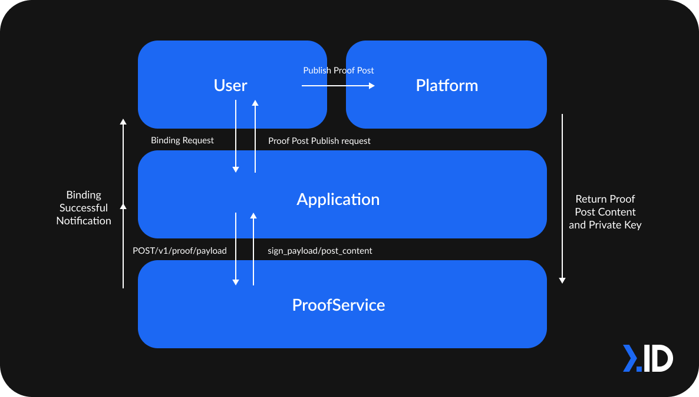

Here, we'll go through the core system design concepts of Next.ID and DIDs.
## Avatars in Next.ID
Avatar key pairs are created, and will be used to perform actions via Next.ID (eg. sign a follow action) for both on-chain & off-chain activities. Next.ID's relation aggregation can map all these actions:

## [ProofService](../core-concepts/proof-service/intro.md)

### [Binding an Avatar to an Application](../getting-started/twitter-wallet-binding.md)

In this scenario, the user requests an Avatar Binding to an Application, allowing an Avatar to be bound to a user account on the Application. `ProofService` returns `sign_payload` and post-content based on the Application’s `POST /v1/proof/payload`.

Then, the Application requests for the user’s Avatar's Private Key to generate a signature based on `sign_payload`. Following which, the user publishes the Proof Post on target platforms. The Proof Post link and ID with `uuid` and `created_at` will be sent to `ProofService` per request and be verified from the Application’s post-content.

After `ProofService` validates the Proof Post's existence and verifies the Private Key, it will relay the successful binding notification back to Application and User.

Example of how it will look like to a user: The user requests for an account (eg: @nextdotid on Twitter) to be bound to their Avatar. The user signs a transaction to authenticate ownership of the account of the Twitter account. Thzte Avatar then generates a public tweet with a signature. When published by the user, this tweet, along with the signature, independently verifies the user's linking of the account to the Avatar.

### Binding an Avatar to an Application via Ethereum wallet
In this scenario, the user requests an Avatar Binding to an Application with identity `0xWALLET_ADDRESS`. `ProofService` will return the Avatar's `sign_payload` based on the Application’s `POST /v1/proof/payload`.

Then, the Application requests the user’s Avatar's Private Key to generate a signature based on Avatar`sign_payload`. After that, the Application requests user’s Wallet's Private Key to generate a signature based on Wallet`sign_payload`.

`ProofService`validates the `uuid` and `created_at` with `sign_payload`, then verifies the Avatar's and Wallet's signature. After this, it will relay the successful binding notification back to the Application and User.

### Revoke Binding
In this scenario, User revokes a previously-established Binding made with an Application. `ProofService` will return the Avatar's `sign_payload` based on the Application’s `POST /v1/proof/payload` as a Revoke action.

Then, the Application requests the user’s Avatar Private Key to generate a signature based on `sign_payload`.

After `ProofService`validates the signature with `uuid` and `created_at` from `sign_payload` , it verifies the Avatar's and Wallet's signatures for a Revoke action. When this is done, it will relay the successful Revoke notification back to the Application and user.

## [KVService](../core-concepts/proof-service/kvservice.md)

### [Write Data](core-concepts/proof-service/ks-intro#write-data)

In this scenario, User requests for a modification on an Application. `KVService` will return the `sign_payload` based on the Application’s `POST /v1/KV/payload`.

Then, the application requests the user’s Avatar's Private Key to generate a signature based on `sign_payload`.

After `KVService` validates the signature with `uuid` and `created_at` from `sign_payload` , it will then verify the Avatar Signature for the Write Data action. After that, it will relay the successful notification back to Application and User.

