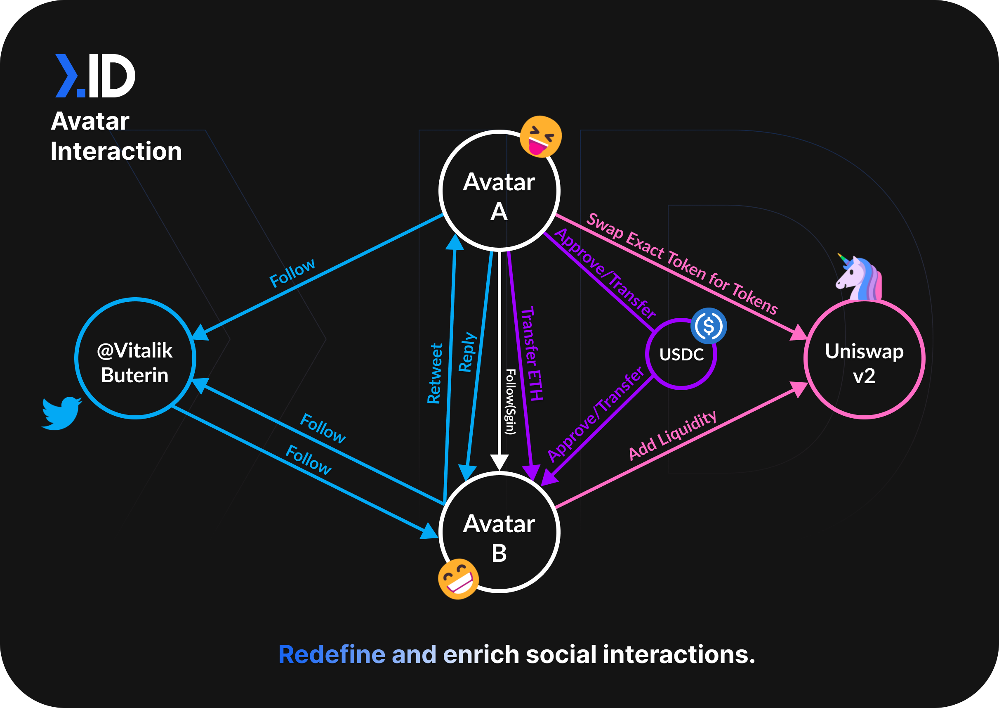
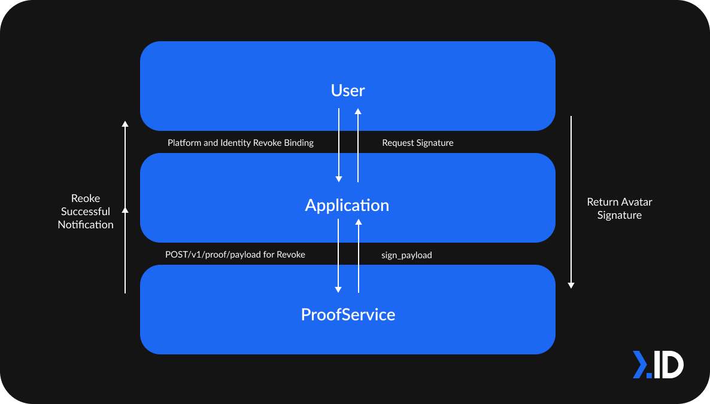
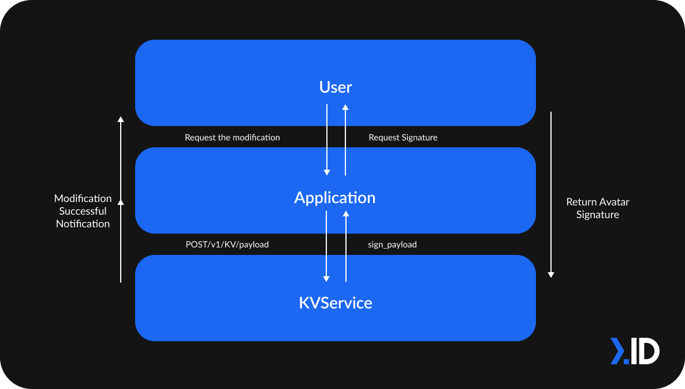

# How does Next.ID work

Next.ID has a simple workflow on the backend. In this page, we go through the core system design concept of Next.ID. This is also a guide to creating your first application with Next.ID. 

## Avatar in Next.ID

Avatars can perform actions via Next.ID (eg. sign a follow action) and on-chain & off-chain activities. Next.ID's relation aggregation can map all of these actions:

How two users' Avatars interact:

## ProofService

### Platform Binding

In this scenario, User requests Platform Binding on Application, `ProofService` will return `sign_payload` and post-content based on the Application’s `POST /v1/proof/payload`. 

Then, application requests user’s Avatar Private Key to generate a signature based on `sign_payload`. After that, user publishes Proof Post on target platforms, the Proof Post link and ID with `uuid` and `created_at` will send to `ProofService` per request and verify from Platforms’ post content. 

After `ProofService`validate the Proof Post existence and verify the Private Key, it will return the successful binding notification back to Application and User.

### Ethereum Binding

In this scenario, User requests Ethereum Binding on Application with identity `0xWALLET_ADDRESS`, `ProofService` will return the Avatar`sign_payload` based on the Application’s `POST /v1/proof/payload`. 

Then, application requests user’s Avatar Private Key to generate a signature based on Avatar`sign_payload`. After that, application requests user’s Wallet Private Key to generate a signature based on Wallet`sign_payload`.

After `ProofService`validate with `uuid` and `created_at` from `sign_payload` , then verify the Avatar and Wallet Signature. After all it will return the successful binding notification back to Application and User.

### Revoke Binding

In this scenario, User requests Revoke Binding on Application, `ProofService` will return the Avatar`sign_payload` based on the Application’s `POST /v1/proof/payload` as Revoke action. 

Then, application requests user’s Avatar Private Key to generate a signature based on `sign_payload`. 

After `ProofService`validate with `uuid` and `created_at` from `sign_payload` , then verify the Avatar and Wallet Signature for Revoke action. After all it will return the successful Revoke notification back to Application and User. 

## KVService

### Write Data

In this scenario, User requests the modification on Application, `KVService` will return the `sign_payload` based on the Application’s POST/v1/KV/payload. 

Then, application requests user’s Avatar Private Key to generate a signature based on `sign_payload`. 

After `KVService`validate with `uuid` and `created_at` from `sign_payload` , then verify the Avatar Signature for Write Data action. After all it will return the successful notification back to Application and User. 

